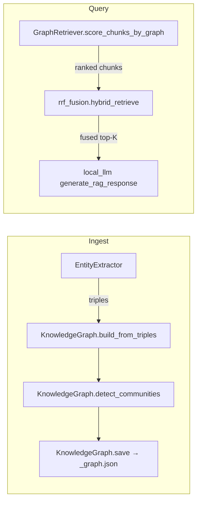
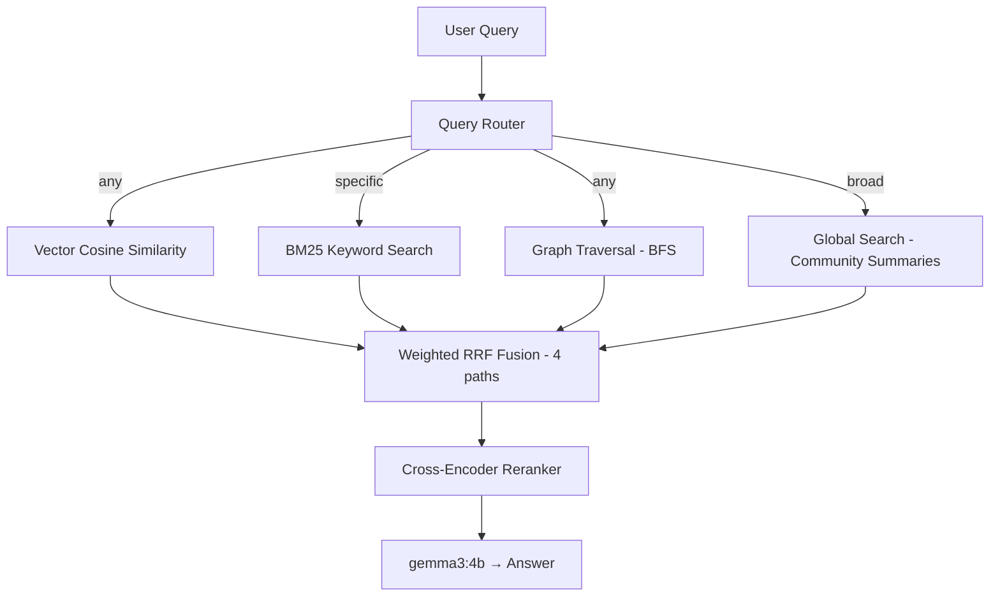

# 3.8 — GraphRAG Community Summaries + Global-Search Path

## Goal

Close the one architectural gap vs. Microsoft GraphRAG: we currently detect Leiden communities during ingest and stop. This plan adds:

1. **Ingest-time**: Generate a short LLM summary per community, persisted in `_graph.json`.
2. **Query-time**: A "global search" path that scores community summaries against the query and feeds the best ones into RRF fusion as a 4th ranked list — especially effective for broad/summarization queries.

---

## User Review Required

> [!IMPORTANT]
> **LLM cost at ingest.** Community summary generation adds 1 LLM call per Leiden community during ingest. A typical 5-page PDF produces 3–8 communities; a 25-page paper could yield 15–30. On `gemma3:4b` (8GB RAM), each call takes ~2–5s, so worst case adds ~2.5 min to a large ingest. The feature is **opt-in** (`ENABLE_COMMUNITY_SUMMARIES=false` by default) to avoid surprising existing users.

> [!WARNING]
> **Embedding dependency.** Global search needs to score community summaries against the query. Two approaches:
> - **Option A (lightweight)**: Simple keyword/TF-IDF overlap scoring — no extra embedding calls, faster, but less semantically precise.
> - **Option B (semantic)**: Embed each community summary at ingest time and store the vectors in the graph JSON. At query time, compute cosine similarity between query embedding and summary embeddings. More accurate but adds N embedding calls at ingest.
>
> **I recommend Option B** — N is small (3–30 summaries), the embedder is already loaded, and semantic matching is the whole point. But if you want zero extra ingest cost, Option A works.

---

## Open Questions

1. **Summary length** — Should community summaries be 2–3 sentences (concise, lower token cost at query time) or a short paragraph (richer context for the LLM)? I'm defaulting to 2–3 sentences.

2. **Weight redistribution** — When community summaries are available and the route is "broad", should the 4th weight be carved out of graph weight (since they're related), or should all three existing weights shrink proportionally? Default plan: shrink all three proportionally to make room for a 0.2 community weight, so `(0.4, 0.3, 0.3)` becomes `(0.32, 0.24, 0.24, 0.20)`.

---

## Current Architecture — What Exists



**Key files and their roles:**

| File | Role in 3.8 |
|---|---|
| [knowledge_graph.py](file:///home/lunge/Documents/repos/rag-app/python/retrieval/knowledge_graph.py) | Holds `KnowledgeGraph` class — will gain `generate_community_summaries()` |
| [graph_retrieval.py](file:///home/lunge/Documents/repos/rag-app/python/retrieval/graph_retrieval.py) | Holds `GraphRetriever` — will gain `global_search()` method |
| [compute_embeddings.py](file:///home/lunge/Documents/repos/rag-app/python/compute_embeddings.py) | Ingest pipeline — will call summary generation after `detect_communities()` |
| [local_llm.py](file:///home/lunge/Documents/repos/rag-app/python/local_llm.py) | Query pipeline — `make_retrieve_pipeline()` will wire global search into fusion |
| [rrf_fusion.py](file:///home/lunge/Documents/repos/rag-app/python/retrieval/rrf_fusion.py) | `hybrid_retrieve()` — already supports N-way fusion, just needs the 4th list |
| [config/models.py](file:///home/lunge/Documents/repos/rag-app/python/config/models.py) | New env vars |

---

## Proposed Changes

### 1. Config — New Environment Variables

#### [MODIFY] [models.py](file:///home/lunge/Documents/repos/rag-app/python/config/models.py)

Add after the `ENABLE_KNOWLEDGE_GRAPH` block (~L81):

```python
# Community summary generation during ingest (requires ENABLE_KNOWLEDGE_GRAPH=true)
ENABLE_COMMUNITY_SUMMARIES = (
    os.environ.get('ENABLE_COMMUNITY_SUMMARIES', 'false').lower() == 'true'
)
# Weight for community summary results in RRF fusion (used when summaries exist)
COMMUNITY_SUMMARY_WEIGHT = float(os.environ.get('COMMUNITY_SUMMARY_WEIGHT', '0.2'))
```

Also export from [config/\_\_init\_\_.py](file:///home/lunge/Documents/repos/rag-app/python/config/__init__.py).

---

### 2. Ingest-Time: Generate & Persist Community Summaries

#### [MODIFY] [knowledge_graph.py](file:///home/lunge/Documents/repos/rag-app/python/retrieval/knowledge_graph.py)

**Add `generate_community_summaries(llm, embedder=None)`** after `detect_communities()` (~L162):

```python
COMMUNITY_SUMMARY_PROMPT = """Summarize the following group of related entities and their relationships in 2-3 sentences.
Focus on what this group is about and how the entities relate to each other.

Entities: {entities}
Relationships: {relationships}

Summary:"""


def generate_community_summaries(self, llm, embedder=None) -> dict[int, dict]:
    """
    Generate LLM summaries for each Leiden community.

    For each community:
    1. Collect member entities and their edge predicates
    2. Prompt LLM for a 2-3 sentence summary
    3. Optionally embed the summary for semantic search

    Returns dict[community_id -> {"summary": str, "entities": list, "embedding": list|None}]
    """
    if not self._communities:
        return {}

    community_ids = set(self._communities.values())
    summaries = {}

    for cid in sorted(community_ids):
        members = self.get_community_members(cid)
        if len(members) < 2:
            # Skip singleton communities — no meaningful relationships
            continue

        # Collect relationships within this community
        relationships = []
        for u, v, attrs in self.graph.edges(data=True):
            if u in members and v in members:
                preds = attrs.get("predicates", [])
                for p in preds[:3]:  # cap per-edge predicates
                    relationships.append(f"{u} {p} {v}")

        if not relationships:
            continue

        prompt = COMMUNITY_SUMMARY_PROMPT.format(
            entities=", ".join(members[:20]),  # cap entity list length
            relationships="; ".join(relationships[:15]),
        )

        try:
            summary_text = llm.generate_response(
                prompt=prompt, temperature=0.3, max_tokens=200
            )
            summary_text = (summary_text or "").strip()
        except Exception:
            summary_text = ""

        if not summary_text:
            continue

        entry = {
            "summary": summary_text,
            "entities": members,
            "embedding": None,
        }

        # Optionally embed the summary for semantic scoring at query time
        if embedder:
            try:
                vecs = embedder.encode_text([summary_text], task_type="search_document")
                if vecs and vecs[0]:
                    entry["embedding"] = vecs[0]
            except Exception:
                pass

        summaries[cid] = entry

    self._community_summaries = summaries
    return summaries
```

**Modify `save()` / `load()`** to persist/restore `community_summaries`:

- In `save()`, add `data["community_summaries"] = self._community_summaries` (serialize `int` keys as strings for JSON).
- In `load()`, restore `self._community_summaries` from `data.get("community_summaries", {})` with int-key coercion.

**Add accessor**:

```python
@property
def community_summaries(self) -> dict:
    return getattr(self, '_community_summaries', {})
```

**Backward compatibility**: Legacy `_graph.json` files without `"community_summaries"` will load fine — `_community_summaries` defaults to `{}`, and the global search path gracefully returns no results.

---

### 3. Ingest Pipeline Wiring

#### [MODIFY] [compute_embeddings.py](file:///home/lunge/Documents/repos/rag-app/python/compute_embeddings.py)

In the KG construction block (~L587–599), after `kg.detect_communities()`:

```python
# Add after: kg.detect_communities()
if ENABLE_COMMUNITY_SUMMARIES:
    logger.info(f"[KG] Generating community summaries for PDF {pdf_id}...")
    from embeddings.ollama_embed import OllamaEmbedder as _SummaryEmbedder
    summary_embedder = _SummaryEmbedder(
        model_name=EMBEDDING_MODEL_NAME, batch_size=EMBED_BATCH_SIZE
    )
    summaries = kg.generate_community_summaries(kg_llm, embedder=summary_embedder)
    logger.info(
        f"[KG] Generated {len(summaries)} community summaries for PDF {pdf_id}"
    )
```

Also import `ENABLE_COMMUNITY_SUMMARIES` from config at the top.

---

### 4. Query-Time: Global Search Method

#### [MODIFY] [graph_retrieval.py](file:///home/lunge/Documents/repos/rag-app/python/retrieval/graph_retrieval.py)

**Add `global_search(query, embedder=None, top_k=3)` method** to `GraphRetriever`:

```python
def global_search(self, query: str, embedder=None, top_k: int = 3) -> list[dict]:
    """
    Score community summaries against the query and return the best ones
    as pseudo-chunks for RRF fusion.

    Uses cosine similarity if summary embeddings are available,
    otherwise falls back to keyword overlap scoring.
    """
    summaries = self.kg.community_summaries
    if not summaries:
        return []

    scored = []

    # Try semantic scoring first
    if embedder and any(s.get("embedding") for s in summaries.values()):
        try:
            query_vec = embedder.encode_text([query], task_type="search_query")[0]
            import numpy as np
            for cid, entry in summaries.items():
                emb = entry.get("embedding")
                if not emb:
                    continue
                # Cosine similarity
                q = np.array(query_vec)
                s = np.array(emb)
                denom = (np.linalg.norm(q) * np.linalg.norm(s))
                sim = float(np.dot(q, s) / denom) if denom > 0 else 0.0
                scored.append((cid, entry, sim))
        except Exception:
            scored = []  # fall through to keyword scoring

    # Fallback: keyword overlap scoring
    if not scored:
        query_words = set(query.lower().split())
        for cid, entry in summaries.items():
            summary_words = set(entry["summary"].lower().split())
            overlap = len(query_words & summary_words)
            score = overlap / max(len(query_words), 1)
            scored.append((cid, entry, score))

    scored.sort(key=lambda x: x[2], reverse=True)

    results = []
    for cid, entry, score in scored[:top_k]:
        if score <= 0:
            continue
        results.append({
            "text": entry["summary"],
            "page": "community",  # not page-specific
            "source": f"Community {cid} ({len(entry['entities'])} entities)",
            "chunk_index": int(cid),
            "score": score,
            "retrieval_method": "community_summary",
        })

    logger.info(f"[GraphRetriever] Global search: {len(results)} community summaries scored")
    return results
```

---

### 5. Fusion Integration

#### [MODIFY] [rrf_fusion.py](file:///home/lunge/Documents/repos/rag-app/python/retrieval/rrf_fusion.py)

**Extend `hybrid_retrieve()` signature** to accept an optional 4th path:

```python
def hybrid_retrieve(
    query, pdf_id, vector_results,
    bm25_index=None, knowledge_graph=None, graph_retriever=None,
    vector_weight=0.4, bm25_weight=0.3, graph_weight=0.3,
    community_results=None,       # NEW
    community_weight=0.0,         # NEW
    rrf_k=60, top_k=10,
) -> list[dict]:
```

Add after the graph traversal block (~L203):

```python
# Path D: Community summary global search
if community_results:
    ranked_lists.append(community_results)
    weights.append(community_weight)
    logger.info(f"[Hybrid] Community summaries: {len(community_results)} results")
```

No other changes needed — `rrf_fuse()` already handles N lists.

---

### 6. Query Pipeline Wiring

#### [MODIFY] [local_llm.py](file:///home/lunge/Documents/repos/rag-app/python/local_llm.py)

**In `make_retrieve_pipeline()` (~L500–626):**

After loading `knowledge_graph` and `graph_retriever`, check for community summaries:

```python
has_community_summaries = (
    knowledge_graph is not None
    and bool(knowledge_graph.community_summaries)
)
```

**In `_retrieve_and_format()` inner function:**

When calling `hybrid_retrieve()`, conditionally add the community results:

```python
community_results = None
community_w = 0.0

if has_community_summaries and graph_retriever:
    community_results = graph_retriever.global_search(
        query_text, embedder=embedder, top_k=3
    )
    if community_results:
        community_w = COMMUNITY_SUMMARY_WEIGHT
        # Proportionally shrink existing weights to make room
        scale = (1.0 - community_w) / max(v_w + b_w + g_w, 0.001)
        v_w *= scale
        b_w *= scale
        g_w *= scale

fused = hybrid_retrieve(
    query=query_text,
    pdf_id=pdf_id,
    vector_results=retrieved,
    bm25_index=bm25_index,
    knowledge_graph=knowledge_graph,
    graph_retriever=graph_retriever,
    vector_weight=v_w,
    bm25_weight=b_w,
    graph_weight=g_w,
    community_results=community_results,     # NEW
    community_weight=community_w,            # NEW
    rrf_k=RRF_K,
    top_k=vector_limit,
)
```

Also import `COMMUNITY_SUMMARY_WEIGHT` from config.

---

### 7. Docker Compose

#### [MODIFY] [docker-compose.yml](file:///home/lunge/Documents/repos/rag-app/docker-compose.yml)

Add to backend environment:

```yaml
- ENABLE_COMMUNITY_SUMMARIES=${ENABLE_COMMUNITY_SUMMARIES:-false}
- COMMUNITY_SUMMARY_WEIGHT=${COMMUNITY_SUMMARY_WEIGHT:-0.2}
```

---

### 8. Tests

#### [NEW] [test_phase8_graphrag.py](file:///home/lunge/Documents/repos/rag-app/python/tests/test_phase8_graphrag.py)

Test cases:

| # | Test | What it verifies |
|---|---|---|
| 1 | `test_community_summary_generation` | MockLLM returns expected summaries; `_community_summaries` populated correctly |
| 2 | `test_community_summaries_persist_load` | `save()` writes summaries to JSON; `load()` restores them with int keys |
| 3 | `test_legacy_graph_no_summaries` | Loading a `_graph.json` without `community_summaries` key → `community_summaries` is `{}`, no crash |
| 4 | `test_global_search_keyword_fallback` | `global_search()` with no embeddings uses keyword overlap scoring |
| 5 | `test_global_search_semantic` | `global_search()` with mock embeddings returns cosine-scored results |
| 6 | `test_hybrid_retrieve_four_paths` | `rrf_fuse()` correctly merges 4 ranked lists with 4 weights |
| 7 | `test_community_weight_redistribution` | Weight scaling preserves sum ≈ 1.0 after carving out community weight |

---

### 9. Documentation Updates

#### [MODIFY] [AGENTS.md](file:///home/lunge/Documents/repos/rag-app/AGENTS.md)

- Mark 3.8 as ✅ in the Tier 3 table
- Add `ENABLE_COMMUNITY_SUMMARIES` and `COMMUNITY_SUMMARY_WEIGHT` to the env vars table

#### [MODIFY] [README_v2.md](file:///home/lunge/Documents/repos/rag-app/README_v2.md)

- Update roadmap: 3.8 → ✅
- Add env vars to Configuration Reference table
- Update architecture diagram to show the 4th retrieval path

---

## Architecture After 3.8



**Data flow at ingest:**

```
PDF → chunks → embeddings → Qdrant
             → BM25 index
             → entity extraction → KG triples → build graph
                                              → detect communities
                                              → generate community summaries (NEW)
                                              → embed summaries (NEW)
                                              → save _graph.json
```

---

## Verification Plan

### Automated Tests

```bash
cd /home/lunge/Documents/repos/rag-app/python
python -m pytest tests/test_phase8_graphrag.py -v
```

### Integration Test

1. Re-ingest the eval fixture with `ENABLE_COMMUNITY_SUMMARIES=true`:
   ```bash
   ENABLE_COMMUNITY_SUMMARIES=true python -m evaluation.run_benchmark \
     --dataset evaluation/datasets/sample.yaml --reset
   ```
2. Verify `_graph.json` now contains `"community_summaries"` key with non-empty entries
3. Verify broad-summary questions in the benchmark show `community_summary` in their `retrieval_methods`

### Quality Check

Run the benchmark twice — once with `ENABLE_COMMUNITY_SUMMARIES=false` (baseline) and once `true` — and compare win rates on the broad-summary question subset. Expected: community summaries improve or tie on broad questions, no regression on specific questions.

---

## Execution Checklist

```
- [ ] 1. Add config vars (models.py, __init__.py)
- [ ] 2. Implement generate_community_summaries() in knowledge_graph.py
- [ ] 3. Update save()/load() for summary persistence
- [ ] 4. Wire summary generation in compute_embeddings.py
- [ ] 5. Implement global_search() in graph_retrieval.py
- [ ] 6. Extend hybrid_retrieve() in rrf_fusion.py
- [ ] 7. Wire global search in local_llm.py make_retrieve_pipeline()
- [ ] 8. Update docker-compose.yml
- [ ] 9. Write test_phase8_graphrag.py
- [ ] 10. Update AGENTS.md + README_v2.md
```

Estimated effort: **2–3 days** (1 day implementation, 0.5 day tests, 0.5–1 day integration testing + benchmark comparison).
