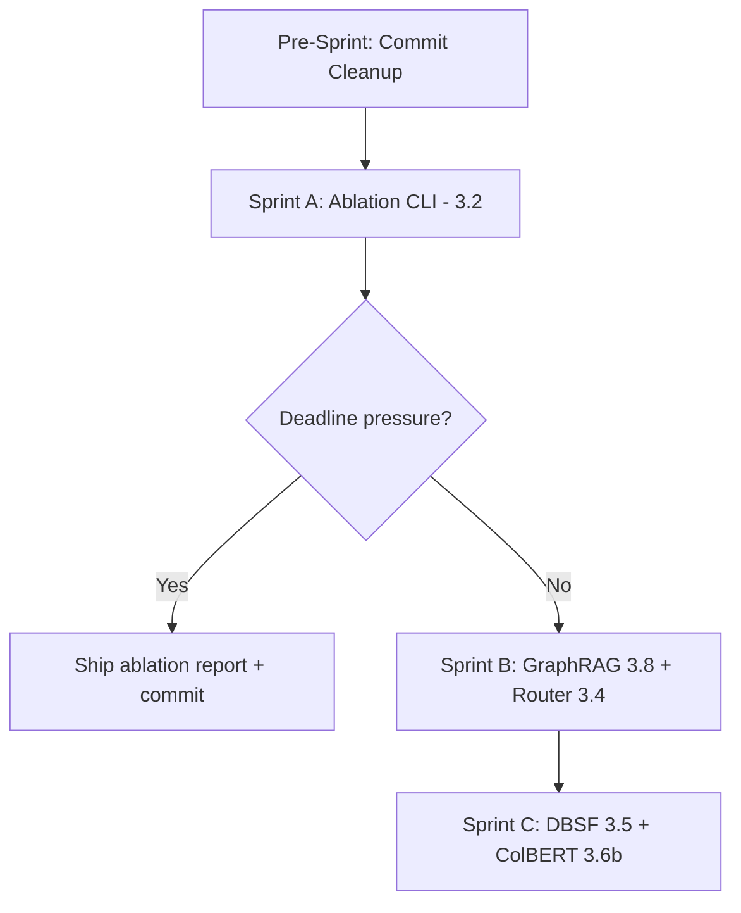

# Next Steps — Remaining Tier 3 Work

## Current State Summary

**Phases 1–4 are shipped.** Tier 2 (2.1–2.6) is complete. Within Tier 3, five items are done (3.1, 3.3, 3.6a, 3.7, 3.9) and five remain:

| ID | Item | Effort | Impact |
|---|---|---|---|
| **3.2** | Ablation CLI | 1–2 days | 🔴 Critical — strongest single artifact for patent + academic write-up |
| **3.8** | GraphRAG community summaries + global search | 2–3 days | 🟠 High — closes the one architectural gap vs. Microsoft GraphRAG |
| **3.4** | Adaptive-RAG router (complexity-aware) | 1–2 days | 🟡 Medium — saves tokens, improves routing accuracy |
| **3.5** | DBSF / learned fusion alternative to RRF | 2–3 days | 🟡 Medium — 1–3% nDCG lift, needs larger corpus to demonstrate |
| **3.6b** | ColBERT-v2 late-interaction reranker | 2–3 days | 🟢 Low until corpus grows — cross-encoder dominates at current topM=50 |

**Additionally**, there is uncommitted work (batch embed, reranker, Ollama tuning, bench CLI, new tests) sitting in the working tree per `git status`. This should be committed first.

---

## User Review Required

> [!IMPORTANT]
> **Sprint priorities depend on your deadline.** If you have a fixed panel date or patent filing deadline, Sprint A alone (ablation CLI + commit cleanup) gives you the most defensible deliverable. Sprints B and C add depth but are multi-day each.

> [!IMPORTANT]
> **Hardware constraint check.** Sprint B (GraphRAG community summaries) generates one LLM summary per Leiden community during ingest — this multiplies LLM calls further on top of KG extraction. On 8GB RAM with `gemma3:4b`, ingest for a 20-page PDF could take 15–30+ minutes. Are you OK with that cost, or should we make community summaries optional behind an `ENABLE_COMMUNITY_SUMMARIES` flag (default `false`)?

---

## Open Questions

1. **Ablation dataset size** — The ablation needs ≥20 questions to be statistically meaningful. The current `harder.yaml` has 15; `sample.yaml` has 10. Should I extend `harder.yaml` to 20–25 questions, or create a combined dataset that merges both?

2. **Adaptive-RAG "no-retrieval" path** — Item 3.4 proposes a third route: *parametric* (answer from LLM knowledge alone, skip retrieval entirely). This is useful for greetings / meta-questions but risks wrong answers on in-document questions if the router misclassifies. Should we include this "no-retrieval" path, or keep it as a two-way router with a new *"multi-hop"* class that triggers decomposition automatically?

3. **DBSF vs. RRF** — DBSF (Distribution-Based Score Fusion) normalizes scores by distribution before fusing. It's tuning-free but assumes score distributions are roughly Gaussian. Do you want DBSF as a selectable *alternative* (`FUSION_METHOD=dbsf`), or should it *replace* RRF if benchmarks show improvement?

---

## Proposed Changes

### Pre-Sprint: Commit Cleanup (30 min)

Commit the accumulated uncommitted work before any new development.

#### Files to commit

| Action | File(s) |
|---|---|
| Modified | `AGENTS.md`, `DEPLOYMENT.md`, `README_v2.md`, `docker-compose.yml` |
| Modified | `python/compute_embeddings.py`, `python/config/__init__.py`, `python/config/models.py` |
| Modified | `python/embeddings/ollama_embed.py`, `python/llm/ollama_llm.py`, `python/local_llm.py` |
| Modified | `python/reranker/simple_reranker.py` |
| New | `python/evaluation/bench_ollama.py` |
| New | `python/tests/test_phase5_batch_embed.py`, `test_phase6_rerank.py`, `test_phase7_ollama_tuning.py` |
| New | `.agents/`, `skills-lock.json` |
| Gitignore | Add `__pycache__/`, `*.pyc` patterns if not already present |

Commit message: `feat: batch embed, cross-encoder reranker, Ollama infra tuning (Tier 3.1/3.6a/3.7/3.9)`

---

### Sprint A: Ablation CLI (3.2) — ~1.5 days

> **Why first:** The ablation table is the single most defensible artifact for both the provisional patent and any academic panel. It proves each component adds measurable value.

#### [NEW] [ablation.py](file:///home/lunge/Documents/repos/rag-app/python/evaluation/ablation.py)

New CLI module: `python -m evaluation.ablation --dataset <path> [--output <dir>]`

**Configurations to run** (each is a different wiring of the retrieve + generate pipeline):

| Config Name | Vector | BM25 | KG | Agent | Decomp | Rerank |
|---|---|---|---|---|---|---|
| `vector_only` | ✅ | ❌ | ❌ | ❌ | ❌ | ❌ |
| `vector_bm25` | ✅ | ✅ | ❌ | ❌ | ❌ | ❌ |
| `vector_bm25_kg` | ✅ | ✅ | ✅ | ❌ | ❌ | ❌ |
| `hybrid_rerank` | ✅ | ✅ | ✅ | ❌ | ❌ | ✅ |
| `hybrid_agent` | ✅ | ✅ | ✅ | ✅ | ❌ | ✅ |
| `full_pipeline` | ✅ | ✅ | ✅ | ✅ | ✅ | ✅ |

**Technical approach:**
- Extend `runner.py` with a new `run_ablation_config()` that accepts a config dict specifying which components are enabled
- Each config selectively:
  - Skips BM25 index loading (`bm25_index=None`)
  - Skips KG loading (`knowledge_graph=None`)
  - Bypasses agent loop (direct generate)
  - Toggles reranking on/off
- Reuse `EvaluationJudge` for scoring
- Emit per-config aggregate metrics + pairwise deltas

#### [NEW] [ablation_report.py](file:///home/lunge/Documents/repos/rag-app/python/evaluation/ablation_report.py)

Generate `ablation.md` + `ablation.json`:
- Table: config × metric (faithfulness, relevancy, recall, conciseness)
- Per-component delta rows: "+BM25" = `vector_bm25 − vector_only`, "+KG" = `vector_bm25_kg − vector_bm25`, etc.
- Statistical significance (Wilcoxon) for each delta if n ≥ 20
- Heatmap-style emoji markers (🟢 significant improvement, 🟡 directional, ⚪ no difference)

#### [MODIFY] [runner.py](file:///home/lunge/Documents/repos/rag-app/python/evaluation/runner.py)

Add `run_ablation_one()` function that accepts a structured config object controlling which retrieval paths are active. The existing `run_one()` stays unchanged for backward compatibility.

#### [NEW] [test_ablation.py](file:///home/lunge/Documents/repos/rag-app/python/tests/test_ablation.py)

Pytest suite with MockLLM verifying:
- All 6 configs produce `RunResult` with correct trace metadata
- Disabling BM25 zeroes out BM25 contributions
- Disabling KG zeroes out graph contributions
- Report generation produces valid markdown + JSON

---

### Sprint B: GraphRAG Community Summaries (3.8) + Adaptive Router (3.4) — ~3 days

#### 3.8 — GraphRAG Community Summaries

##### [MODIFY] [knowledge_graph.py](file:///home/lunge/Documents/repos/rag-app/python/retrieval/knowledge_graph.py)

- After `detect_communities()`, add `generate_community_summaries(llm)`:
  - For each Leiden community, collect member entities + their edge predicates + source chunk previews
  - Prompt LLM to produce a 2–3 sentence summary per community
  - Store as `self._community_summaries: dict[int, str]`
  - Persist in the `_graph.json` under a new `"community_summaries"` key
  - Make optional behind `ENABLE_COMMUNITY_SUMMARIES` env var (default `false`)

##### [MODIFY] [graph_retrieval.py](file:///home/lunge/Documents/repos/rag-app/python/retrieval/graph_retrieval.py)

- Add `global_search(query, top_k)` method:
  - Map-reduce pattern: score each community summary against the query (cosine sim of summary embedding vs. query embedding), take top-3 communities
  - Return the community summaries as context chunks (with `retrieval_method: "community_summary"`)
  - Wire into `rrf_fusion.py` as a 4th ranked list when the router classifies the query as "broad"

##### [MODIFY] [local_llm.py](file:///home/lunge/Documents/repos/rag-app/python/local_llm.py)

- In the hybrid retrieval path, when community summaries are available and query is "broad", include community summary results in the RRF fusion

##### [MODIFY] [config/models.py](file:///home/lunge/Documents/repos/rag-app/python/config/models.py)

- Add `ENABLE_COMMUNITY_SUMMARIES` (bool, default `false`)
- Add `COMMUNITY_SUMMARY_WEIGHT` (float, default `0.2`) — 4th RRF weight for community summaries

##### [NEW] [test_phase8_graphrag.py](file:///home/lunge/Documents/repos/rag-app/python/tests/test_phase8_graphrag.py)

---

#### 3.4 — Adaptive-RAG Router

##### [MODIFY] [query_router.py](file:///home/lunge/Documents/repos/rag-app/python/agent/query_router.py)

- Extend `classify()` from 2-way (`specific` | `broad`) to 3-way (`specific` | `broad` | `multi_hop`):
  - `specific`: keyword-heavy, factoid → bias BM25
  - `broad`: summarization, overview → bias graph (+ community summaries if available)
  - `multi_hop`: multi-part, comparative, cross-section → auto-enable decomposition for this query
- Update `adjust_weights()` to handle the 3rd route
- `multi_hop` route sets an `auto_decompose` flag that the control loop reads, enabling decomposition for that single query even if `ENABLE_DECOMPOSITION=false`

##### [MODIFY] [control_loop.py](file:///home/lunge/Documents/repos/rag-app/python/agent/control_loop.py)

- Read `auto_decompose` from router result
- When `auto_decompose=True` and decomposer is None, create a one-shot decomposer + fusion for that query

##### [MODIFY] [prompts.py](file:///home/lunge/Documents/repos/rag-app/python/agent/prompts.py)

- Update `ROUTER_PROMPT` to include `MULTI_HOP` as a classification option with examples

##### [NEW] [test_phase9_adaptive_router.py](file:///home/lunge/Documents/repos/rag-app/python/tests/test_phase9_adaptive_router.py)

---

### Sprint C: DBSF Fusion (3.5) + ColBERT (3.6b) — ~3 days (research depth)

> [!NOTE]
> These items require a larger evaluation corpus (≥20 questions, ideally with 2+ distractor PDFs) to demonstrate measurable improvement. They are highest-value for patent novelty claims but lowest urgency for academic panel demos.

#### 3.5 — Distribution-Based Score Fusion (DBSF)

##### [NEW] [dbsf_fusion.py](file:///home/lunge/Documents/repos/rag-app/python/retrieval/dbsf_fusion.py)

- Implement DBSF: normalize each ranked list's scores to [0,1] using `(score - min) / (max - min)`, then weight-sum
- Fallback to RRF when any list has < 3 results (distribution unreliable)

##### [MODIFY] [rrf_fusion.py](file:///home/lunge/Documents/repos/rag-app/python/retrieval/rrf_fusion.py)

- Add `FUSION_METHOD` dispatcher: `rrf` (default) or `dbsf`
- `hybrid_retrieve()` reads the method and delegates accordingly

##### [MODIFY] [config/models.py](file:///home/lunge/Documents/repos/rag-app/python/config/models.py)

- Add `FUSION_METHOD` (str, default `rrf`)

#### 3.6b — ColBERT-v2 Late-Interaction Reranker

##### [NEW] [colbert_reranker.py](file:///home/lunge/Documents/repos/rag-app/python/reranker/colbert_reranker.py)

- Use `colbert-ai/colbert` or `ragatouille` library
- Token-level MaxSim scoring
- Selectable via `RERANKER=colbert` env var

##### [MODIFY] [simple_reranker.py](file:///home/lunge/Documents/repos/rag-app/python/reranker/simple_reranker.py)

- Add factory function `get_reranker(method)` that returns either CrossEncoderReranker or ColBERTReranker

---

## Recommended Execution Order

| Sprint | Duration | Deliverables |
|---|---|---|
| **Pre-Sprint** | 30 min | Clean commit of all accumulated Tier 3 work |
| **Sprint A** | 1.5 days | `ablation.md` with per-component contribution table on ≥20 questions |
| **Sprint B** | 3 days | Community summaries for broad queries; 3-way adaptive router |
| **Sprint C** | 3 days | DBSF fusion alternative; ColBERT reranker for large topM |

---

## Verification Plan

### Automated Tests
- `python -m pytest tests/test_ablation.py -v` (Sprint A)
- `python -m pytest tests/test_phase8_graphrag.py -v` (Sprint B)
- `python -m pytest tests/test_phase9_adaptive_router.py -v` (Sprint B)
- Full benchmark: `python -m evaluation.ablation --dataset evaluation/datasets/harder.yaml`

### Manual Verification
- Ablation report reviewed for monotonic improvement across component additions
- Community summaries inspected for coherence on the eval fixture PDF
- Router classification checked on the 15 harder.yaml questions (expect ~5 multi-hop, ~5 specific, ~5 broad)
- Docker `backend` logs verified for no stdout pollution
