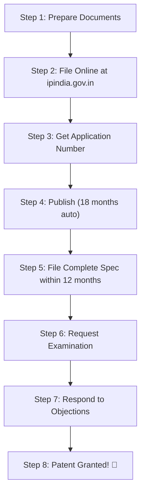

# 🇮🇳 Complete Guide: Filing a Patent in India as a College Student

> [!TIP]
> As a college student, you qualify as a **"Natural Person / Startup / Small Entity"** under Indian patent law, which gives you **up to 80% fee reduction** on all government fees. This guide is tailored specifically for your situation.

---

## Table of Contents

1. [Understanding Patent Types](#1-understanding-patent-types)
2. [Step-by-Step Filing Process](#2-step-by-step-filing-process)
3. [Complete Fee Structure (2024–2026)](#3-complete-fee-structure)
4. [Documents Required](#4-documents-required)
5. [Where & How to File](#5-where--how-to-file)
6. [Timeline & What to Expect](#6-timeline--what-to-expect)
7. [Tips for College Students](#7-tips-for-college-students)
8. [Your Specific Case: RAG System Patent](#8-your-specific-case)

---

## 1. Understanding Patent Types

| Type | Protection | Duration | Best For |
|---|---|---|---|
| **Provisional Patent** | Establishes **priority date** only; not a granted patent | 12 months to file complete spec | Early-stage inventions still being developed |
| **Complete Patent** | Full legal protection after grant | **20 years** from filing date | Fully developed inventions |

### Which Should You File First?

> [!IMPORTANT]
> **File a Provisional Specification first.** This is the recommended strategy for students because:
> - It's **cheaper** (₹1,600 vs ₹8,000 for complete)
> - It **locks in your priority date** — nobody can claim the same invention after this date
> - You get **12 months** to refine your invention, complete your project, and file the complete specification
> - You already have a provisional specification ready (`PROVISIONAL_PATENT_SPECIFICATION.md`)

---

## 2. Step-by-Step Filing Process

### Phase 1: Provisional Application (Do This NOW)



---

### Step 1: Prepare Your Documents

You need to prepare and gather these forms:

| Form | Purpose | Status for You |
|---|---|---|
| **Form 1** | Application for Patent | ❌ Need to fill |
| **Form 2** | Provisional Specification | ✅ **Already prepared** (`PROVISIONAL_PATENT_SPECIFICATION.md`) |
| **Form 3** | Statement & Undertaking (if filed abroad) | Only if filing in other countries too |
| **Form 26** | Authorization of Patent Agent (if using one) | Only if hiring an agent |
| **Form 28** | Fee declaration as Natural Person / Small Entity | ❌ Need to fill — **critical for fee discount** |

---

### Step 2: Register on the Indian Patent Office Portal

1. Go to **[https://ipindia.gov.in](https://ipindia.gov.in)**
2. Click **"e-Filing"** → **"Patent"**
3. Create an account on the **IP India e-filing portal**: [https://ipindiaonline.gov.in/epatentfiling/](https://ipindiaonline.gov.in/epatentfiling/)
4. Register as **"Natural Person"** (individual applicant)
5. Use your **Aadhaar** or PAN for identity verification

---

### Step 3: File the Provisional Application Online

1. Log in to the e-filing portal
2. Select **"Patent Application — Provisional"**
3. Upload the following:
   - **Form 1** (Application form — filled online)
   - **Form 2** (Your provisional specification — upload as PDF)
   - **Form 28** (Declaration as Natural Person for reduced fees)
4. Pay the fees online (UPI / Net Banking / Card)
5. **Download and save your acknowledgement** — it contains your **Application Number**

---

### Step 4: Publication (Automatic)

- Your application is **automatically published** in the Patent Journal **18 months** after filing
- You can request **early publication** by filing **Form 9** + ₹2,500 fee (Natural Person rate)
- Early publication is recommended if you want to establish public record sooner

---

### Step 5: File Complete Specification (Within 12 Months)

> [!CAUTION]
> **If you don't file the complete specification within 12 months of the provisional filing, your application is ABANDONED.** This is a hard deadline — set multiple reminders!

The Complete Specification must include:
- Full technical description with enough detail for someone skilled in the field to reproduce it
- **Claims** — the specific legal boundaries of what you're protecting (most important part!)
- Abstract (150 words max)
- Drawings/Diagrams

---

### Step 6: Request for Examination (RFE)

- File **Form 18** to request examination
- Must be filed **within 48 months** from filing date (but file it early!)
- Fee: ₹4,000 (Natural Person)
- An examiner will review your patent and issue a **First Examination Report (FER)**

---

### Step 7: Respond to Examiner's Objections

- You'll receive a **First Examination Report (FER)** with objections/observations
- You have **6 months** to respond (extendable by 3 months)
- Common objections:
  - **Lack of novelty** — examiner found similar prior art
  - **Lack of inventive step** — invention is "obvious"
  - **Insufficient description** — need more technical detail
  - **Broad claims** — need to narrow your claims
- You can amend your claims and submit arguments

---

### Step 8: Patent Grant

- If the examiner is satisfied, the **Controller of Patents** will grant your patent
- Published in the **Patent Journal**
- Patent is valid for **20 years from the filing date** (subject to annual renewal fees)

---

## 3. Complete Fee Structure

> [!NOTE]
> India has **three fee categories**: Natural Person (individual), Small Entity (startup), and Large Entity (corporation). As a student filing individually, you qualify as a **Natural Person** and get the cheapest rates. All fees below are the **Natural Person** rates (as per Schedule I of the Patent Rules, updated 2024).

### Filing Fees

| Fee Type | Form | Natural Person (You) | Small Entity | Large Entity |
|---|---|---|---|---|
| **Provisional Application** | Form 1 + Form 2 | **₹1,600** | ₹4,000 | ₹8,000 |
| **Complete Application** (after provisional) | Form 2 | **₹4,000** | ₹10,000 | ₹20,000 |
| **Complete Application** (direct, no provisional) | Form 1 + Form 2 | **₹4,000** | ₹10,000 | ₹20,000 |
| **Form 28 Declaration** | Form 28 | **₹0** (Free) | ₹0 | N/A |

### Processing Fees

| Fee Type | Form | Natural Person (You) |
|---|---|---|
| **Early Publication Request** | Form 9 | **₹2,500** |
| **Request for Examination (RFE)** | Form 18 | **₹4,000** |
| **Expedited Examination** (startup only) | Form 18A | ₹8,000 (startup) |
| **Response to FER** | Form 13 | **₹0** (Free) |
| **Amendment of Application** | Section 57 | **₹0** (before grant) |

### Post-Grant Renewal Fees (Annual)

| Year | Natural Person (You) |
|---|---|
| 3rd to 6th year | **₹800/year** |
| 7th to 10th year | **₹2,400/year** |
| 11th to 15th year | **₹4,800/year** |
| 16th to 20th year | **₹8,000/year** |

### 💰 Total Estimated Cost Breakdown (Your Case)

| Stage | Cost | When |
|---|---|---|
| **Provisional Filing** (Form 1 + Form 2 + Form 28) | **₹1,600** | Now |
| **Complete Specification** (Form 2 amendment) | **₹4,000** | Within 12 months |
| **Request for Examination** (Form 18) | **₹4,000** | Within 48 months |
| **Early Publication** (optional, Form 9) | ₹2,500 | Anytime after filing |
| | | |
| **Minimum Total (without agent)** | **₹9,600** | Over ~2 years |
| **With Early Publication** | **₹12,100** | Over ~2 years |

> [!TIP]
> **If you hire a Patent Agent**, expect an additional **₹10,000–₹25,000** for drafting claims and handling the complete specification. For a student budget, self-filing the provisional and getting agent help only for the complete specification's **claims section** is the smartest strategy.

---

## 4. Documents Required

### Personal Documents
- [ ] **Aadhaar Card** (for identity on e-filing portal)
- [ ] **PAN Card** (optional but recommended)
- [ ] **College ID** (proof of student status, useful for startup scheme applications)
- [ ] **Address Proof** (Aadhaar serves as this)

### Patent Documents
- [ ] **Form 1** — Application for Grant of Patent (filled online on portal)
- [ ] **Form 2** — Provisional Specification ✅ **You have this ready**
- [ ] **Form 28** — Status declaration as Natural Person (for reduced fees)
- [ ] **Drawings/Diagrams** — Architecture diagrams (you have these in your spec)
- [ ] **Priority Document** — Only if claiming priority from another country (not applicable for you)

### For Complete Specification (Later)
- [ ] **Detailed technical description** with reproducibility
- [ ] **Claims** (numbered legal statements defining the scope of protection) — **MOST IMPORTANT**
- [ ] **Abstract** (150 words summarizing the invention)
- [ ] **Formal drawings** meeting patent office standards

---

## 5. Where & How to File

### Online Filing (Recommended)

| Detail | Info |
|---|---|
| **Portal** | [https://ipindiaonline.gov.in/epatentfiling/](https://ipindiaonline.gov.in/epatentfiling/) |
| **Payment** | UPI, Net Banking, Debit/Credit Card |
| **Document Format** | PDF (max 10MB per document) |
| **Digital Signature** | Not mandatory for provisional; recommended for complete |

### Patent Office Jurisdictions

Your filing office depends on your residential address:

| Region | Patent Office | States Covered |
|---|---|---|
| **Delhi** | New Delhi | Delhi, UP, Haryana, HP, J&K, Punjab, Rajasthan, Uttarakhand, Chandigarh |
| **Mumbai** | Mumbai | Maharashtra, Gujarat, Goa, MP, Chhattisgarh, Daman & Diu |
| **Chennai** | Chennai | TN, AP, Telangana, Kerala, Karnataka, Puducherry, Lakshadweep |
| **Kolkata** | Kolkata | WB, Bihar, Jharkhand, Odisha, Assam, NE States, A&N Islands |

> [!NOTE]
> For online filing, you can file from anywhere — the portal automatically routes to the correct office based on your address.

---

## 6. Timeline & What to Expect

```
Month 0     ──── File Provisional Application (₹1,600)
                  ↳ You get Application Number & Priority Date
                  
Month 1-11  ──── Develop your project further, prepare complete spec
                  
Month 12    ──── DEADLINE: File Complete Specification (₹4,000)
                  ↳ If missed, application is ABANDONED
                  
Month 12-18 ──── Application gets published (auto at 18 months)
                  ↳ Or pay ₹2,500 for early publication
                  
Month 12-48 ──── File Request for Examination (₹4,000)
                  ↳ File early for faster processing
                  
Month 18-36 ──── Examiner reviews → First Examination Report (FER)
                  ↳ Average wait: 6-18 months after RFE
                  
Month 24-42 ──── Respond to FER objections (6 months window)
                  
Month 30-48 ──── Patent Granted (if all objections resolved)
                  ↳ Total timeline: typically 2-4 years
```

---

## 7. Tips for College Students

### 🎓 Ownership & IP Rights

> [!WARNING]
> **Check your college's IP policy BEFORE filing!** Many universities have clauses that:
> - Claim ownership of inventions created using college resources/labs
> - Require you to list the college as co-applicant
> - Require assignment of patent rights to the institution
>
> **Action:** Read your college's IP policy document. If no such policy exists, you own 100% of the rights as the inventor.

### 💡 Key Tips

1. **File provisional ASAP** — The priority date is everything. Even if your project is 60% complete, file the provisional now. You can add more detail in the complete specification.

2. **Don't publicly disclose before filing** — If you present your invention at a conference, publish a paper, or even post details on GitHub **before** filing, it may count as prior art and destroy your novelty. File first, then publish.

3. **Keep a dated lab notebook** — Document your development process with dates. This is evidence of your inventive process.

4. **Prior Art Search** — Before filing, search these databases to ensure your invention is novel:
   - [InPASS (Indian Patent Search)](https://ipindiaservices.gov.in/PublicSearch)
   - [Google Patents](https://patents.google.com/)
   - [WIPO PATENTSCOPE](https://patentscope2.wipo.int/search/en/search.jsf)
   - [USPTO](https://www.uspto.gov/patents/search)

5. **Consider SIPP Scheme** — The **Scheme for Facilitating Startups Intellectual Property Protection (SIPP)** provides:
   - **Free patent agent** facilitation (government-appointed)
   - Fee reduction for startup entities
   - Check: [https://www.startupindia.gov.in/](https://www.startupindia.gov.in/)

6. **Claims are KING** — Your claims define what's legally protected. The description can be broad, but claims must be specific, well-structured, and defensible. Consider getting professional help just for claims drafting.

7. **Software patents in India** — Pure software/algorithms are **NOT patentable** under Section 3(k) of the Indian Patents Act. However, software that provides a **"technical effect"** or solves a **"technical problem"** IS patentable. Your RAG system qualifies because it solves technical problems (retrieval accuracy, hallucination reduction, resource optimization) using a novel technical architecture.

### 🏫 College Support Channels

- **IPR Cell** — Many colleges have an Intellectual Property Rights cell that helps students file patents (often for free)
- **NIRF Ranking Incentive** — Colleges get NIRF ranking boost from student patents — use this as leverage to get institutional support
- **Incubation Centers** — If your college has a startup incubation center (IIC/IEDC), they often fund patent filings
- **DST/AICTE Grants** — Various government schemes reimburse patent filing costs for student innovations

---

## 8. Your Specific Case: RAG System Patent

### Strengths of Your Application

Your **"Neuro-Symbolic Agentic System and Method for Retrieval-Augmented Generation"** has several strong points:

| Aspect | Why It's Strong |
|---|---|
| **Novelty** | Tri-Layer Cognitive Architecture combining agentic control + neuro-symbolic store + fusion retrieval is unique |
| **Technical Effect** | Solves concrete technical problems (hallucination, retrieval accuracy, resource constraints) — bypasses Section 3(k) objection |
| **Reproducibility** | Detailed specification with algorithms, formulas, and architecture diagrams |
| **Working Implementation** | All components are implemented — strengthens the application |

### Recommended Filing Strategy

```
PHASE 1 (NOW):
├── File Provisional Specification ──── Cost: ₹1,600
├── Your Form 2 is ready (PROVISIONAL_PATENT_SPECIFICATION.md)
├── Fill Form 1 online
└── Submit Form 28 for Natural Person fee category

PHASE 2 (Within 6-10 months):
├── Develop remaining components further
├── Draft CLAIMS section (10-15 independent + dependent claims)
├── Prepare formal patent drawings
└── File Complete Specification ──── Cost: ₹4,000

PHASE 3 (After Complete Spec):
├── File RFE (Form 18) ──── Cost: ₹4,000
├── Respond to FER objections
└── Patent Grant 🎉
```

### Sample Claims Structure (For Your Complete Specification Later)

Here's a suggested claims framework for your invention:

**Independent Claims:**
1. A computer-implemented system for retrieval-augmented generation comprising a tri-layer cognitive architecture with... (system claim)
2. A method for processing natural language queries against unstructured documents comprising the steps of... (method claim)
3. A non-transitory computer-readable medium storing instructions for... (computer-readable medium claim)

**Dependent Claims:**
4. The system of claim 1, wherein the agentic control loop comprises a hallucination grader that...
5. The system of claim 1, wherein the hybrid knowledge store comprises a vector database and a knowledge graph...
6. The method of claim 2, wherein the structure-preserving extraction step comprises rendering PDF content as Markdown...
7. The system of claim 1, further comprising resource-aware model orchestration that selectively activates components based on available RAM...

---

## Quick Reference: Useful Links

| Resource | URL |
|---|---|
| **IP India e-Filing Portal** | [ipindiaonline.gov.in](https://ipindiaonline.gov.in/epatentfiling/) |
| **Patent Search (InPASS)** | [ipindiaservices.gov.in/PublicSearch](https://ipindiaservices.gov.in/PublicSearch) |
| **Patent Fee Schedule** | [ipindia.gov.in (Schedule I)](https://ipindia.gov.in/form-and-fees.htm) |
| **Startup India IP Scheme** | [startupindia.gov.in](https://www.startupindia.gov.in/) |
| **Google Patents Search** | [patents.google.com](https://patents.google.com/) |
| **WIPO Patent Search** | [patentscope.wipo.int](https://patentscope2.wipo.int/search/en/search.jsf) |
| **Indian Patents Act, 1970** | [indiacode.nic.in](https://www.indiacode.nic.in/handle/123456789/1593) |

---

> [!IMPORTANT]
> **Your Immediate Next Steps:**
> 1. ✅ Provisional Specification (Form 2) — **DONE** (your `PROVISIONAL_PATENT_SPECIFICATION.md`)
> 2. 🔲 Do a prior art search on Google Patents & InPASS
> 3. 🔲 Check your college's IP policy
> 4. 🔲 Register on [ipindiaonline.gov.in](https://ipindiaonline.gov.in/epatentfiling/)
> 5. 🔲 Fill Form 1 + Form 28 online
> 6. 🔲 Upload Form 2 (convert your spec to PDF) and pay ₹1,600
> 7. 🔲 Save your Application Number — this is your priority date proof!
